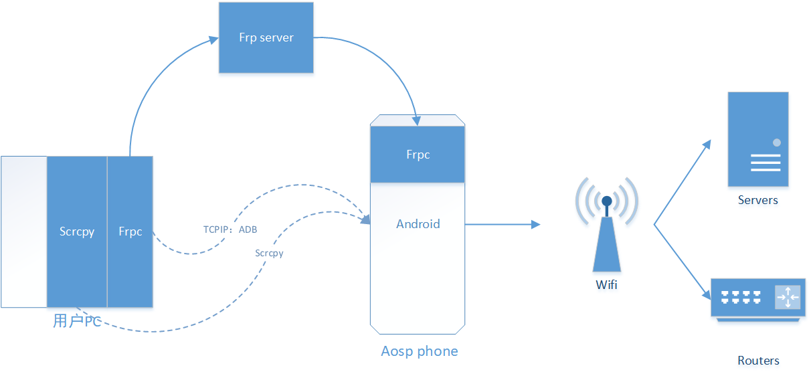

# aosp-server-toolkit
This is a tool set, the goal is to turn a mobile phone that supports aosp into a remotely accessible Linux general server

[中文版](./README_zh.md)

## Introduction
In order to turn the pixel phone into a general Linux server, it can be used to remotely control and monitor home and company networks. Based on the aosp source code, we add the necessary tool set and provide relevant software configuration operation procedures.

The firmware and tools here are currently verified by pixel3, but in theory, as long as they are suitable for mobile phones with the corresponding version of aosp, they can be used. However, we do not necessarily verify them one by one, and users need to verify them by themselves. If you have any questions, please feel free to give us feedback.

## System architecture
Some basic core functions of our solution:
1. Automatically start the machine when powered on
2. Realize the vnc remote effect, using frp+scrcpy
3. Remote shell operation, we use adb shell based on tcpip



## Usage steps
1. Download the corresponding compiled aosp firmware
2. Burn the firmware to the mobile phone and manually configure the mobile phone wifi network to ensure that the mobile phone can connect to the Internet
3. First configuration: perform necessary frpc configuration through adb
4. Remotely log in to the mobile phone and operate
5. Congratulations, you already have an arm64 low-power Linux server with a screen

## Burn
Use Android adb and fastboot tool chain for burning.
### windows
#### windows adb tools
adb version: Version 31.0.3-7562133
fastboot verison: fastboot version 31.0.3-7562133

#### Burning steps
1. Unlock your Android phone to ensure that you can use fastboot normally. Please google the unlocking method according to your phone model and version
2. Download the appropriate firmware compression package and unzip it
3. Start cmd and cd to the unzipped directory
4. Set the environment variable set ANDROID_PRODUCT_OUT=your unzip directory
5. adb reboot bootloader
6. fastboot flashall -w
6. The burning completion prompt is as follows


### mac

#### mac adb tools

***【To be supplemented】***

#### Burning steps
Basically the same as windows, the difference is that the command to set the environment variable is different.

***Differences to be updated******【To be added】***

## First use
Our system is a debug version, so it supports root and remount. When using it for the first time, we need to configure frpc-related services to ensure that we can remotely operate the phone in the future.
### 1. First remount

In order to perform various file operations on the phone, we recommend remounting by default.

```
adb root
adb remount
# A reboot may be prompted here, please perform the necessary reboot
adb reboot
```
### 2. frpc configuration
We mainly use frpc to implement remote scrcpy and adb shell, so you need to deploy a frp server. You can buy a minimally configured vps online.
### frps server
You need a server with a public IP to deploy the frp server. You can download it from the frpc official website, because our mobile phone is integrated with v0.58.0. So we recommend that you also download the corresponding versions for the server and computer client. We assume that the server has enabled the token security mechanism, and the reference configuration is as follows:
```
bindPort = 7000
auth.method = "token"
auth.token = "123"
```
### usb adb connects to the phone and modifies the frpc configuration
```
adb root
adb remount
adb shell
```
```
busybox vi /data/frpc.toml
```
frpc.toml reference content is as follows:
```
serverAddr = "1.1.1.1" # only support ip, do not use domain
serverPort = 7000
auth.method = "token"
auth.token = "000000"

[[proxies]]
name = "secret_proxy"
type = "stcp"
secretKey = "key"
localIP = "127.0.0.1"
localPort = 5555
```
Please modify the above parameters according to the actual parameters of your own server. After modification, adb reboot the phone, re-enter adb shell to confirm whether frpc is running correctly. If you can see the frpc process information correctly, it is preliminarily confirmed that frpc is running:
```
blueline:/ # ps -ef|grep frpc
root 4185 2739 1 19:31:01 ? 00:00:00 frpc -c /data/frpc.toml
root 4194 3639 22 19:31:04 pts/0 00:00:00 grep frpc
```

## Remotely connect to the phone

Refer to our previous technical architecture. When we access remotely through our own computer, we must first run frpc on the computer locally.

### 1. Configure local frpc
```
serverAddr = "1.1.1.1"
serverPort = 7000
auth.method = "token"
auth.token = "123"

[[visitors]]
name = "secret_visitor"
type = "stcp"
serverName = "secret_proxy"
secretKey = "key"
bindAddr = "127.0.0.1"
bindPort = 5555
```
After configuring frpc, we can basically unplug the USB and access the phone just like a remote server. Here we assume that your frps and frpc are configured correctly. If you have errors in this regard, please check the basic network parameters such as network and port firewall.

### 2. Set up tcpip adb and establish a remote adb link
```
adb connect localhost:5555
connected to localhost:5555
```
### 3. Start scrcpy as if you were connecting your phone locally via USB


### 4. If you want to use a shell, you can use adb shell, which feels just like a USB connection
```
adb shell
```
## ssh
Our firmware integrates an ssh client. When we need to use the phone as a springboard server or bastion server to access other ssh servers via ssh, we can use the ssh in the phone to complete it

## vi
You can use busybox vi

## Other tools?
To be added
