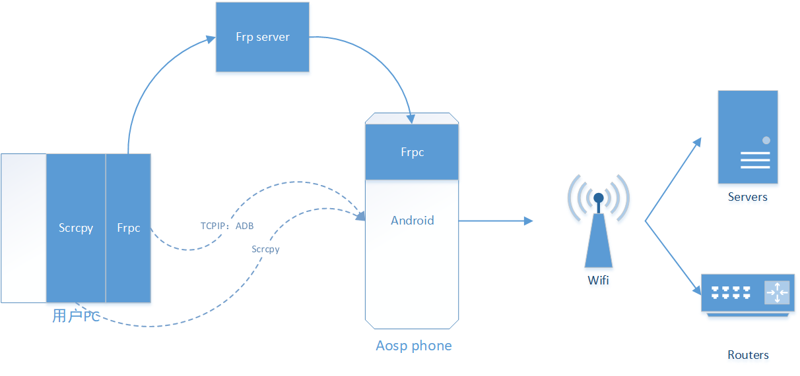
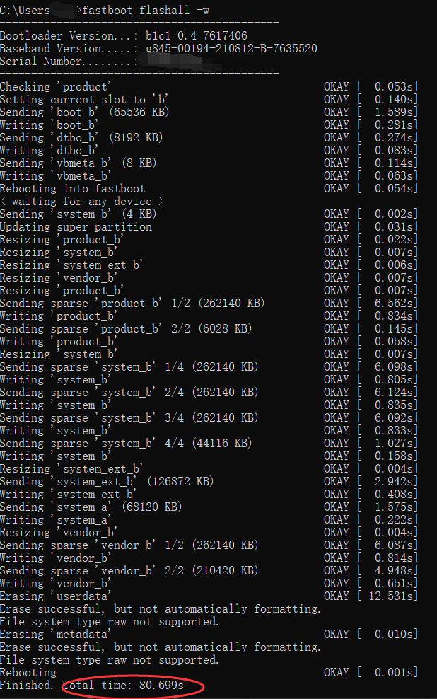
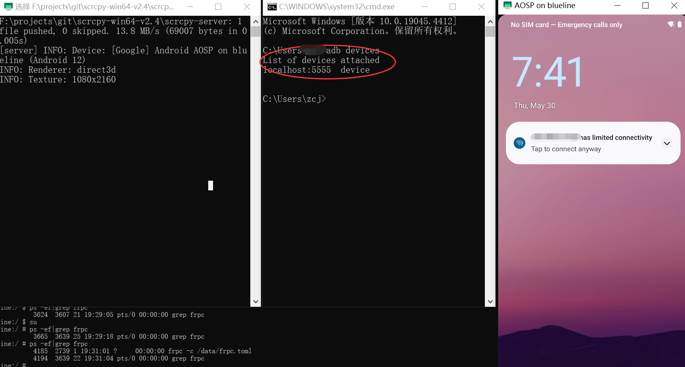

# aosp-server-toolkit
这个是一个工具集合，目标是将支持aosp的手机变成一个可以远程访问的linux 通用服务器

## 简介
为了将pixel手机变成一台通用linux服务器，用来实现远程控制监控家庭和公司网络的目的。我们基于aosp源码，添加必要的工具集，并给出相关的软件配置操作流程等。

这里的固件和工具，当前通过pixel3验证，但理论上只要适合aosp对应版本的手机，就都能使用，只是我们不一定都一一验证，需要用户自行验证，有问题欢迎反馈。

## 系统架构
我们方案的一些基本核心功能：
1. 上电自动开机
2. 实现vnc远程效果，采用frp+scrcpy
3. 远程shell操作，我们使用的基于tcpip的 adb shell



## 使用步骤
1. 下载对应编译好的aosp固件
2. 烧录固件到手机，并手动配置手机wifi网络，确保手机能联网
3. 首次配置：通过adb进行必要的frpc配置
4. 远程登录手机，进行操作
5. 恭喜你，你已经拥有了一台 arm64的带有屏幕的低功耗linux服务器了

## 烧录
使用安卓adb，fastboot工具链来进行烧录。
### windows
#### windows adb tools
adb version：Version 31.0.3-7562133
fastboot verison：fastboot version 31.0.3-7562133

#### 烧录步骤
1. 解锁你的安卓手机，保证你能正常使用fastboot，解锁方法请根据你的手机型号和版本自行google
2. 下载合适的固件压缩包，解压
3.  启动cmd，cd到解压的目录内
4.  设置环境变量 set ANDROID_PRODUCT_OUT=your 解压目录
5. adb reboot bootloader
6. fastboot flashall -w
6. 烧录完成提示如下



### mac

#### mac adb tools

***【待补充】***

#### 烧录步骤
和windows的基本一致，不一致的是设置环境变量的命令不同。

***不同之处待更新******【待补充】***

## 首次使用
我们的系统是debug版本，所以支持root和remount。首次使用时，我们需要配置frpc相关的服务，保证我们以后可以远程操作手机。
### 1.  首次remount

为了对手机进行各种文件操作，我们建议默认remount。

```
adb root
adb remount
# 这里可能提示重启，请进行必要的重启 
adb reboot
```
### 2. frpc 配置
我们主要是通过frpc 来实现远程scrcpy和adb shell，所以你需要部署一台frp服务器。可以从网上买一个最小配置的vps。
### frps 服务器
你需要一台有公网ip的服务器，部署frp服务器，具体可以去frpc官网下载，因为我们手机端集成的是v0.58.0。所以我们建议服务器端和电脑客户端，也下载对应的版本。我们假设服务器开启token安全机制，参考配置如下：
```
bindPort = 7000
auth.method = "token"
auth.token = "123"
```
### usb adb连接手机，修改frpc配置
```
adb root
adb remount
adb shell
```
```
busybox vi /data/frpc.toml
```
frpc.toml 参考内容如下：
```
serverAddr = "1.1.1.1" # only support ip, do not use domain
serverPort = 7000
auth.method = "token"
auth.token = "000000"

[[proxies]]
name = "secret_proxy"
type = "stcp"
secretKey = "key"
localIP = "127.0.0.1"
localPort = 5555
```
请根据你自己服务器的实际参数，修改以上参数，修改后adb reboot手机，重新进去adb shell 确认frpc是否正确取运行，如果能正确看到frpc进程信息，就初步确认frp运行起来了：
```
blueline:/ # ps -ef|grep frpc
root     4185  2739 1 19:31:01 ?     00:00:00 frpc -c /data/frpc.toml
root     4194  3639 22 19:31:04 pts/0 00:00:00 grep frpc
```

## 远程连接手机

参看我们前面技术架构，在我们通过自己的电脑远程访问时，我们先要在本地把电脑上的frpc跑起来。

### 1. 配置本地frpc
```
serverAddr = "1.1.1.1"
serverPort = 7000
auth.method = "token"
auth.token = "123"

[[visitors]]
name = "secret_visitor"
type = "stcp"
serverName = "secret_proxy"
secretKey = "key"
bindAddr = "127.0.0.1"
bindPort = 5555
```
在配置完frpc后，我们基本就可以拔掉usb，完全像远程服务器一样来访问手机了。这里我们假设你的frps 和frpc都配置正确。如果你有这方面的错误，请检查网络以及端口防火墙等基本网络参数。

### 2. 设置tcpip adb，建立远程adb链路
```
adb connect localhost:5555
connected to localhost:5555
```
### 3. 像在本地通过usb连接手机一样，启动scrcpy


### 4. 如果想使用shell， 你可以使用adb shell，感觉就跟usb 连接一样
```
adb shell
```
## ssh
我们的固件集成了ssh客户端，当我们需要将手机作为跳板服务器或者堡垒机服务器通过ssh访问别的ssh服务器器时，我们就可以使用手机中的ssh来完成

## vi
你可以使用 busybox vi

## 其他工具？
待补充
